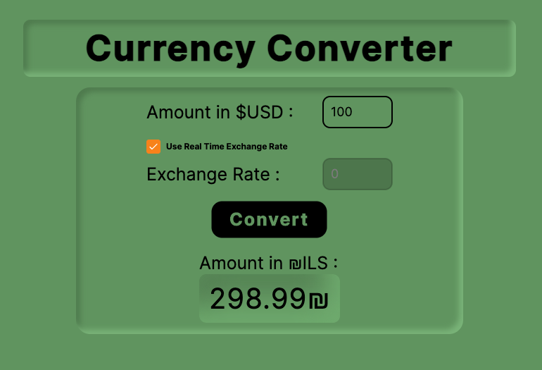
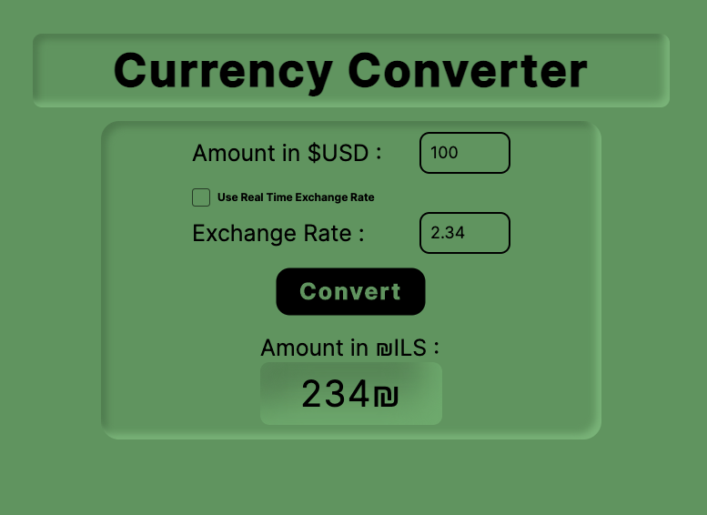

<a href="https://usd-ils-change.netlify.app/">Click Here To Download The .EXE (READY-TO-USE App)</a>

# Real-Time Currency Converter

A modern and intuitive currency conversion application built with **Avalonia UI** and **C#**.

## Overview

Real-Time Currency Converter is a desktop application that allows users to easily convert USD$ to ILS₪ with real-time exchange rates or User Custom Exchange Rate. The application features a clean, contemporary interface with neumorphism effect design and provides instant conversions between USD and other currencies. Users can choose between automatic real-time rates fetched from a live API or manually input custom exchange rates.

## Features

- ✨ **Real-Time Exchange Rates**: Fetch live exchange rates via RapidAPI
- 💱 **Quick Conversion**: Convert USD$ to ILS₪ instantly
- 🎨 **Modern UI Design**: Built with Avalonia featuring neumorphism styling
- 🔧 **Flexible Input**: Toggle between real-time rates and manual rate entry
- ✅ **Input Validation**: Automatic filtering of non-numeric input
- 🖥️ **Multi-Display Support**: Automatic window positioning on secondary displays
- 💻 **Cross-platform**: Runs on Windows, macOS, and Linux

## Screenshot (Real Time Exchange Rate)




## Screenshot (User Exchange Rate)




## Project Structure

```
RealTimeCurrencyConverter/
├── App.axaml              # Application-level XAML definitions
├── App.axaml.cs           # Application code-behind
├── MainWindow.axaml       # Main window UI definition with neumorphism design
├── MainWindow.axaml.cs    # Main window code-behind with event handlers
├── Program.cs             # Application entry point
├── Services/
│   └── RealTimeRate.cs    # Real-time exchange rate API GET Request integration
├── app.manifest           # Application manifest
└── RealTimeCurrencyConverter.csproj
```

## Getting Started

### Prerequisites

- .NET 10.0 or higher
- Visual Studio Code or Visual Studio 2022+
- RapidAPI account (for real-time exchange rate API access)

### Installation

1. Clone the repository:
```bash
git clone <repository-url>
cd RealTimeCurrencyConverter
```

2. Restore dependencies:
```bash
dotnet restore
```

3. Build the project:
```bash
dotnet build
```

### Running the Application

Execute the following command in your terminal:

```bash
dotnet run
```

The application will automatically open on your secondary display if available.

## Technology Stack

- **Framework**: Avalonia UI 11.x
- **Language**: C#
- **.NET**: .NET 10.0
- **API**: RapidAPI Exchange Rates By TJDH 
- **HTTP Client**: System.Net.Http
- **JSON Parsing**: System.Text.Json
- **Platform**: Cross-platform (Windows, macOS, Linux)

## Usage

1. **Launch the application** - The window opens on your secondary monitor if available
2. **Enter the USD amount** - Type the amount in USD you want to convert
3. **Choose exchange rate source**:
   - Check "Use Real Time Exchange Rate" for automatic live rates
   - Or manually enter an exchange rate for custom conversions
4. **View the converted amount** - The result displays in the target currency (ILS)
5. **Switch between modes** - Toggle the checkbox to switch between real-time and manual rates

## Architecture

The application follows a clean separation of concerns:

- **UI Layer**: Avalonia XAML components with neumorphism design
  - `MainWindow.axaml` - Responsive layout with text inputs and checkbox controls
  
- **API Integration Layer**: Async HTTP service for real-time data
  - `RealTimeRate.cs` - Handles RapidAPI calls and JSON parsing
  
- **Code-Behind**: Event handlers for user interactions
  - Input validation with numeric filtering
  - Real-time exchange rate toggling
  - Cross-display window positioning

## Development

### Building for Release

For macOS ARM64 (Apple Silicon):
```bash
dotnet publish -c Release -r osx-arm64 --self-contained true -p:PublishSingleFile=true
```

For macOS x64 (Intel):
```bash
dotnet publish -c Release -r osx-x64 --self-contained true -p:PublishSingleFile=true
```

For Windows x64:
```bash
dotnet publish -c Release -r win-x64 --self-contained true -p:PublishSingleFile=true -p:IncludeNativeLibrariesForSelfExtract=true
```

### Project Configuration

The project is configured in `RealTimeCurrencyConverter.csproj` with:
- Target framework: .NET 10.0
- Output type: Desktop application
- Avalonia NuGet packages
- Multi-platform runtime identifiers

## API Configuration

The application uses the **Exchange Rates 7** API from RapidAPI. To use real-time rates:

1. Sign up at [RapidAPI](https://rapidapi.com/)
2. Subscribe to Exchange Rates 7 API
3. Replace the API key in [Services/RealTimeRate.cs](Services/RealTimeRate.cs) with your own

**Note**: Keep your API key confidential and consider using environment variables for production builds.

## Key Implementation Details

### Input Validation
The application filters non-numeric characters in real-time using the `Input_OnChange_FilterNumbers` method, ensuring only valid numeric input.

### Real-Time Exchange Rates
When enabled, the application asynchronously fetches current exchange rates from the RapidAPI endpoint:
```
GET https://exchange-rates7.p.rapidapi.com/convert?base=USD&target=ILS
```

### Display Management
The application automatically detects secondary monitors and positions the window accordingly for multi-monitor setups.

## Contributing

Feel free to submit issues and enhancement requests! Possible improvements:
- Add support for more currency pairs
- Implement exchange rate history/graphs
- Add offline mode with cached rates
- Create dark/light theme toggle

## License

Created as part of university coursework - English C# & Avalonia UI

## Author

Developed as part of the Avalonia UI course

---

**Last Updated**: April 21, 2026
**Framework Version**: Avalonia UI 11.x
**.NET Version**: .NET 10.0
